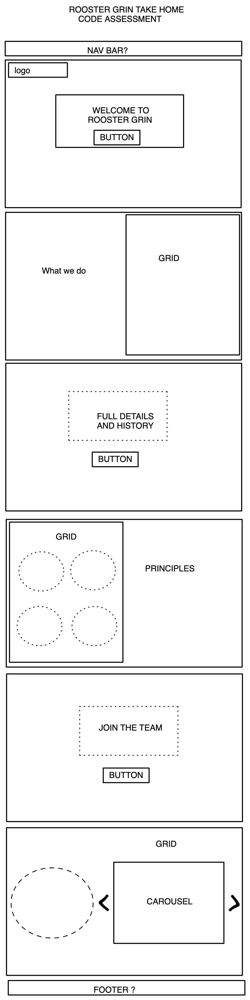

# ROOSTERGRIN Front End Test

## Deployed Site
**[Link to Rooster-app](https://rooster-app.vercel.app/)**

### Hey Peter, I am going to also add the answer to the questions here but since Rooster Grin works with Wordpress I thougtht it fitting to create a wordpress blog and add it there. So please click the link if you would like to see it. -> [https://developing-thoughts.com/PROJECTS/](https://developing-thoughts.com/projects/).
---
## **1. What you technologies you used and why (if you only used html, css, and js please explain any templates or frameworks you may have used i.e. bootstrap)**
### I used bootstrap and it was so much fun getting better at this framework – the reason I chose it is because I wanted to challenge myself to learn something new-ish to me while doing this assessment. If nothing else, I am finishing feeling a little more accomplished.

## **2.Any struggles you faced when developing with technology you chose?**
### Yes, the big one which I am still tweaking as I submit this is the dynamic between the background image resizing to be mobile responsive. While bootstrap makes it easy to resize an image that is inside the div, once it is in the outer-container it becomes a bit tricky.

## **3.What you enjoyed the most and why?**
### I enjoyed the challenge and the layout that was given. There was just enough challenge that it kept me on my toes the whole time. Just like any process there were some frustrating moments but I’m glad I finished it. I am also really looking forward to making improvements on it ie. working on some more of the media queries and maintaining image quality through resizing.

## **Also below I attached a picture of my wireframe - hope it helps. :)**

---

